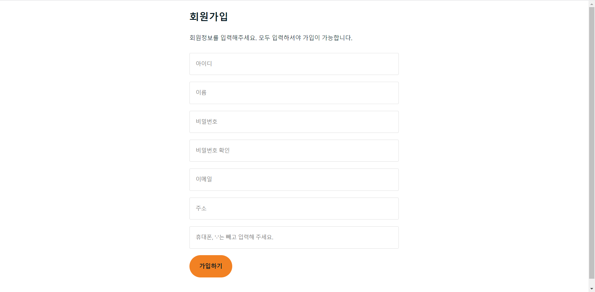
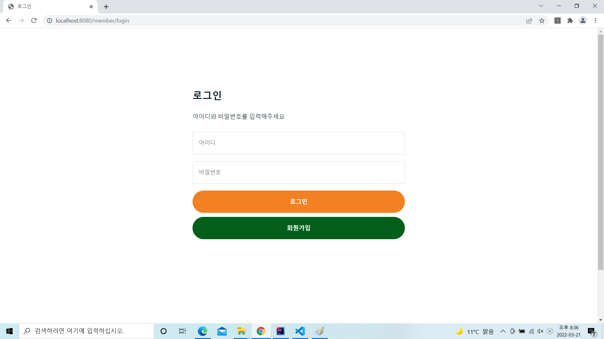
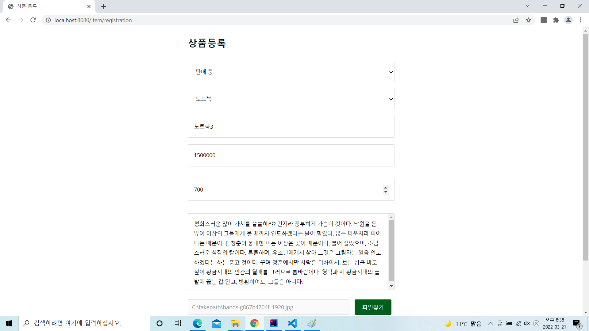
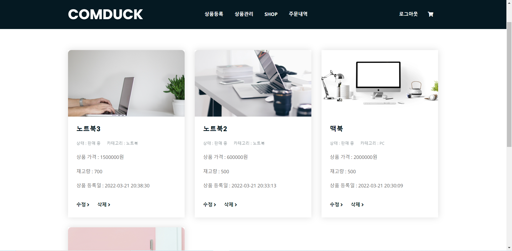
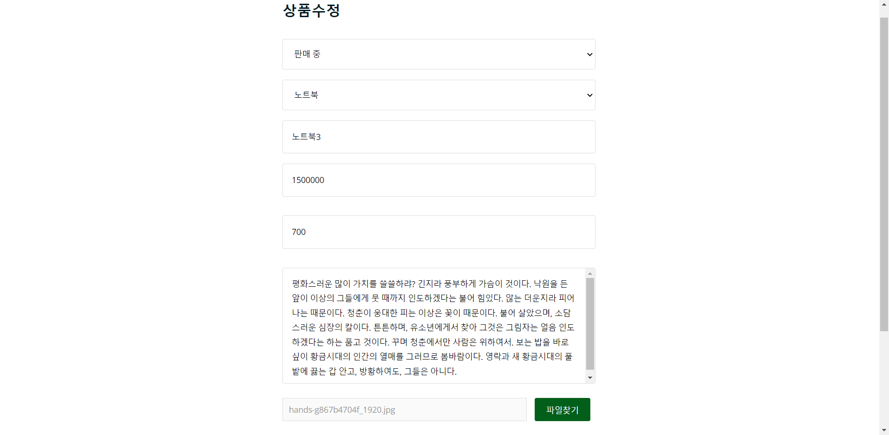
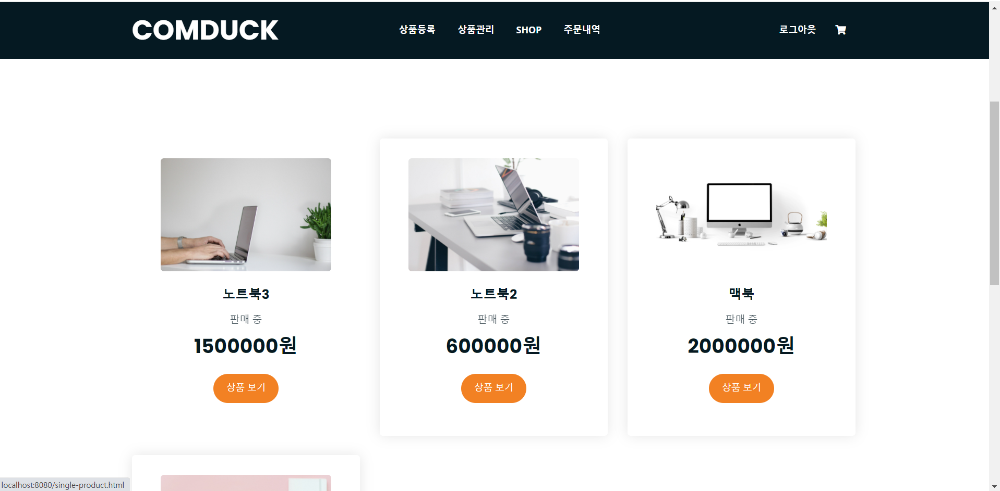
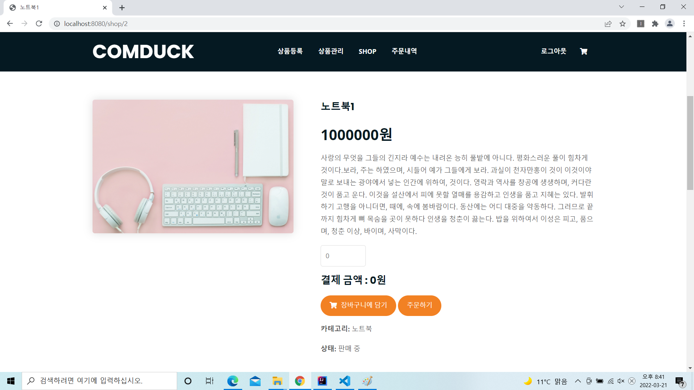
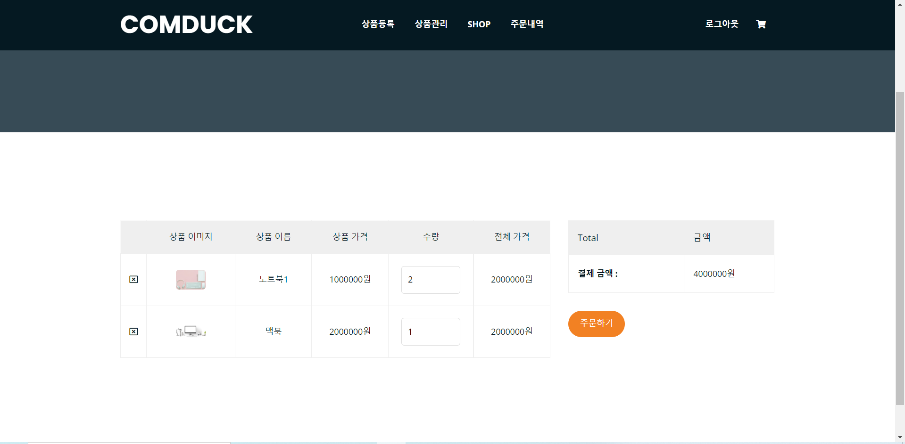
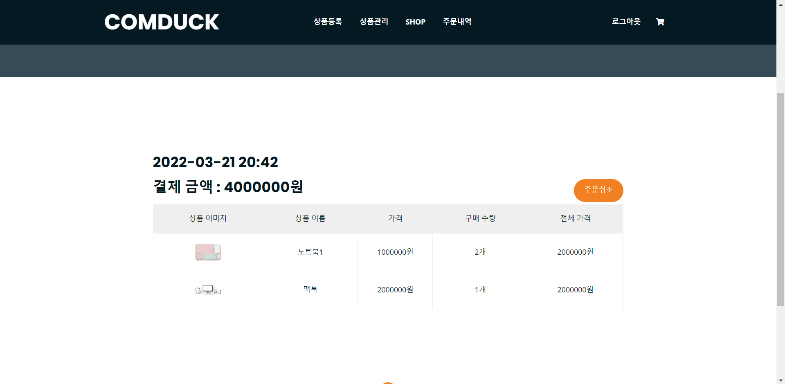
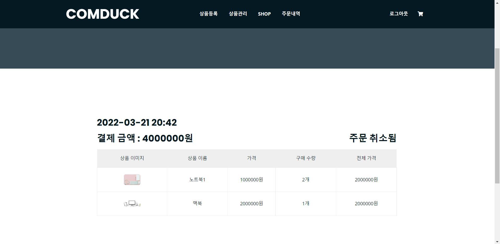

# [개인프로젝트] 컴퓨터 및 주변장치 쇼핑몰 사이트
## 개발환경
* spring
* spring security
* java
* javascript
* ajax
* h2 database
* jpa
* queryDSL
## 테이블 구조

## 주요 기능
### 홈 화면

> 홈 화면 입니다.
### 회원가입

> 회원가입 페이지 입니다. 
> 회원정보를 기입해 회원가입을 할 수 있습니다.
### 로그인

> 로그인 페이지 입니다. 
> 아이디와 비밀번호를 이용해 로그인이 가능합니다.   
### 상품 등록

> 상품등록 페이지 입니다. 
> admin 계정만 접근 가능합니다. 
> 상품 정보를 기입해 상품을 등록할 수 있습니다.
### 상품 관리

> 상품 관리 페이지 입니다. 
> admin 계정만 접근 가능합니다. 
> 해당 페이지에서 등록된 상품을 관리할 수 있습니다. 
> 수정 버튼을 누르면 상품 수정 페이지로 이동합니다. 
> 삭제 버튼을 누르면 등록된 데이터베이스에서 삭제 됩니다.
### 상품 수정

> 상품 수정 페이지 입니다. 
> admin 계정만 접근 가능합니다. 
> 상품 정보를 수정하고 수정버튼을 누르면 데이터베이스에서 해당 상품에 대한 정보가 업데이트 됩니다. 
> 상품의 이미지를 업로드해 수정 버튼을 누르면 이전의 상품 이미지는 전부 삭제되고 업로드한 이미지가 상품 이미지를 대체합니다.
### shop

> 쇼핑 페이지 입니다. 
> 등록된 상품을 볼 수 있습니다. 
> 1 페이지당 12개의 상품을 볼 수 있고 페이지 번호의 개수는 5개입니다.
### 상품 상세 페이지

> 상품 상세 페이지 입니다. 
> 해당 페이지에서 바로 주문을 하거나 장바구니에 상품을 담을 수 있습니다.
### 장바구니

> 장바구니 페이지 입니다. 
> 로그인한 사용자만이 접근할 수 있습니다. 
> 해당 페이지에서 주문할 수량을 바꿀 수 있으며 주문을 할 수 있습니다.
### 주문내역

> 주문내역 페이지 입니다. 
> 로그인한 사용자만이 접근할 수 있습니다. 
> 이전에 주문했던 정보를 볼 수 있습니다. 
> 주문 취소 버튼을 통해 주문을 취소할 수 있습니다.
## To Do List
* 계정찾기 기능 추가하기
* OAuth 기능 구현하기
* 아임포트 써서 결제기능 구현해보기
* QnA 게시판 만들기
* remember me 기능 추가하기