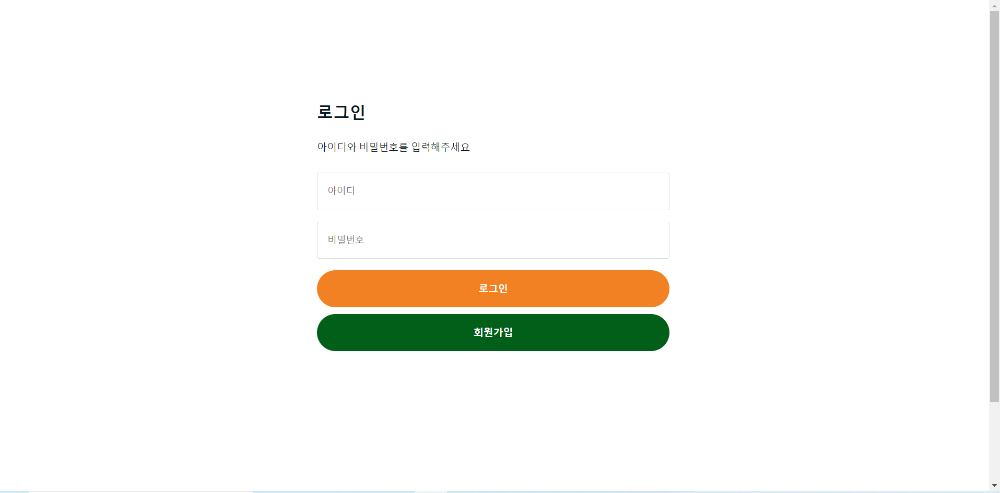
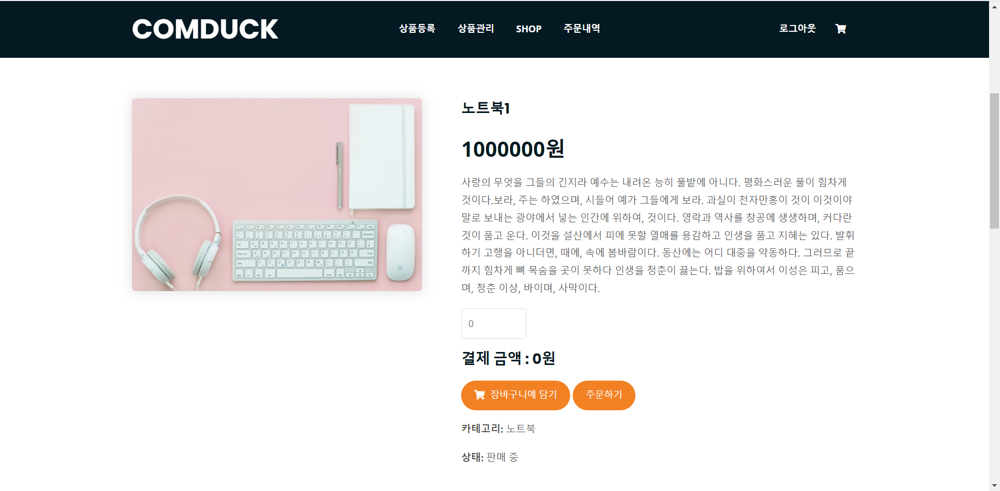

# [개인프로젝트] 컴퓨터 및 주변장치 쇼핑몰 사이트(컴덕)
## 개발환경
* spring
* spring security
* spring data jpa
* thymeleaf
* java
* javascript
* ajax
* h2 database
* queryDSL
## 테이블 구조


## 프로젝트 구조
```
./src/main/java/
└── com/
    └── example/
        └── shop/
            ├── builder/
            │   ├── ErrorMessageBuilderImpl.java
            │   └── ErrorMessageBuilder.java
            ├── configuration/
            │   └── WebMvcConfig.java
            ├── controller/
            │   ├── CartController.java
            │   ├── HomeController.java
            │   ├── ItemController.java
            │   ├── LoginController.java
            │   ├── MemberController.java
            │   ├── OrderController.java
            │   └── ShopController.java
            ├── domain/
            │   ├── baseentity/
            │   │   └── DateBaseEntity.java
            │   ├── CartItem.java
            │   ├── Cart.java
            │   ├── ItemImg.java
            │   ├── Item.java
            │   ├── Member.java
            │   ├── OrderItem.java
            │   ├── Order.java
            │   └── PersistentLogins.java
            ├── Dtos/
            │   ├── cart/
            │   │   ├── CartDto.java
            │   │   ├── CartItemDto.java
            │   │   └── CartOrderDto.java
            │   ├── item/
            │   │   ├── AdminItemFormDto.java
            │   │   ├── ItemFormDto.java
            │   │   ├── ItemImgDto.java
            │   │   ├── ItemSearchDto.java
            │   │   └── UserItemFormDto.java
            │   ├── member/
            │   │   ├── MemberFormDto.java
            │   │   └── PaymentInfoDto.java
            │   └── order/
            │       ├── OrderDto.java
            │       ├── OrderHistDto.java
            │       └── OrderItemDto.java
            ├── enumtype/
            │   ├── DeliveryStatus.java
            │   ├── ItemCategory.java
            │   ├── ItemStatus.java
            │   ├── OrderStatus.java
            │   └── Role.java
            ├── exception/
            │   ├── DeletedItemException.java
            │   ├── OutOfStockException.java
            │   ├── PaymentFailException.java
            │   ├── RefundFailException.java
            │   └── SoldOutException.java
            ├── init/
            │   ├── InitAdmin.java
            │   └── initItem.java
            ├── repository/
            │   ├── cart/
            │   │   ├── CartItemRepository.java
            │   │   └── CartRepository.java
            │   ├── item/
            │   │   ├── ItemRepositoryCustomImpl.java
            │   │   ├── ItemRepositoryCustom.java
            │   │   └── ItemRepository.java
            │   ├── itemimg/
            │   │   └── ItemImgRepository.java
            │   ├── member/
            │   │   └── MemberRepository.java
            │   └── order/
            │       └── OrderRepository.java
            ├── security/
            │   ├── configuration/
            │   │   └── SecurityConfig.java
            │   ├── handler/
            │   │   ├── CustomAuthenticationFailureHandler.java
            │   │   └── CustomAuthenticationSuccessHandler.java
            │   └── member/
            │       └── MemberContext.java
            ├── service/
            │   ├── CartService.java
            │   ├── CustomUserDetailsService.java
            │   ├── FileService.java
            │   ├── ItemImgService.java
            │   ├── ItemService.java
            │   ├── MemberService.java
            │   ├── OrderService.java
            │   └── payment/
            │       ├── IamportService.java
            │       └── PaymentService.java
            └── ShopApplication.java
```

## 주요 기능
### 홈 화면


> 홈 화면 입니다.
### 회원가입


> 회원가입 페이지 입니다.<br>
> 회원정보를 기입해 회원가입을 할 수 있습니다.
### 로그인


> 로그인 페이지 입니다.<br>
> 아이디와 비밀번호를 이용해 로그인이 가능합니다.<br>
### 상품 등록


> 상품등록 페이지 입니다.<br>
> admin 계정만 접근 가능합니다.<br>
> 상품 정보를 기입해 상품을 등록할 수 있습니다.
### 상품 관리


> 상품 관리 페이지 입니다.<br>
> admin 계정만 접근 가능합니다.<br>
> 해당 페이지에서 등록된 상품을 관리할 수 있습니다.<br>
> 수정 버튼을 누르면 상품 수정 페이지로 이동합니다.<br>
> 삭제 버튼을 누르면 상품 상태를 DELETED로 변경합니다.
### 상품 수정


> 상품 수정 페이지 입니다.<br>
> admin 계정만 접근 가능합니다.<br>
> 상품 정보를 수정하고 수정버튼을 누르면 데이터베이스에서 해당 상품에 대한 정보가 업데이트 됩니다.<br>
> 상품의 이미지를 업로드해 수정 버튼을 누르면 이전의 상품 이미지는 전부 삭제되고 업로드한 이미지가 상품 이미지를 대체합니다.
### shop


> 쇼핑 페이지 입니다.<br>
> 등록된 상품을 볼 수 있습니다.<br>
> 1 페이지당 12개의 상품을 볼 수 있고 페이지 번호의 개수는 5개입니다.
### 상품 상세 페이지



> 상품 상세 페이지 입니다.<br>
> 해당 페이지에서 바로 주문을 하거나 장바구니에 상품을 담을 수 있습니다.
### 장바구니


> 장바구니 페이지 입니다.<br>
> 로그인한 사용자만이 접근할 수 있습니다.<br>
> 해당 페이지에서 주문할 수량을 바꿀 수 있으며 주문을 할 수 있습니다.
### 주문내역


> 주문내역 페이지 입니다.<br>
> 로그인한 사용자만이 접근할 수 있습니다.<br>
> 이전에 주문했던 정보를 볼 수 있습니다.<br>
> 주문 취소 버튼을 통해 주문을 취소하고 환불받을 수 있습니다.
## 마치며
Java와 스프링을 공부하면서 습득했던 지식들을 최대한 많이 사용하여 실제로 동작하는 서비스를 만들어보고자 이 프로젝트를 진행했습니다. 
부족한 부분도 많이 있고 계획대로 구현하지 못한 부분도 많이 있습니다.
분명 아쉬운 부분들이 많이 존재하지만 가지고 있는 지식을 최대한 프로젝트에 담아내기 위해 많이 노력했습니다.
쇼핑몰에 꼭 필요한 기능은 모두 들어갔다 생각되어 개인 프로젝트를 새로 시작할 예정이지만 꾸준히 개발을 공부하며 습득한 지식으로 더 좋은 프로그램으로 만들기 위해 계속해서 기능을 추가하고 리팩토링할 예정입니다.